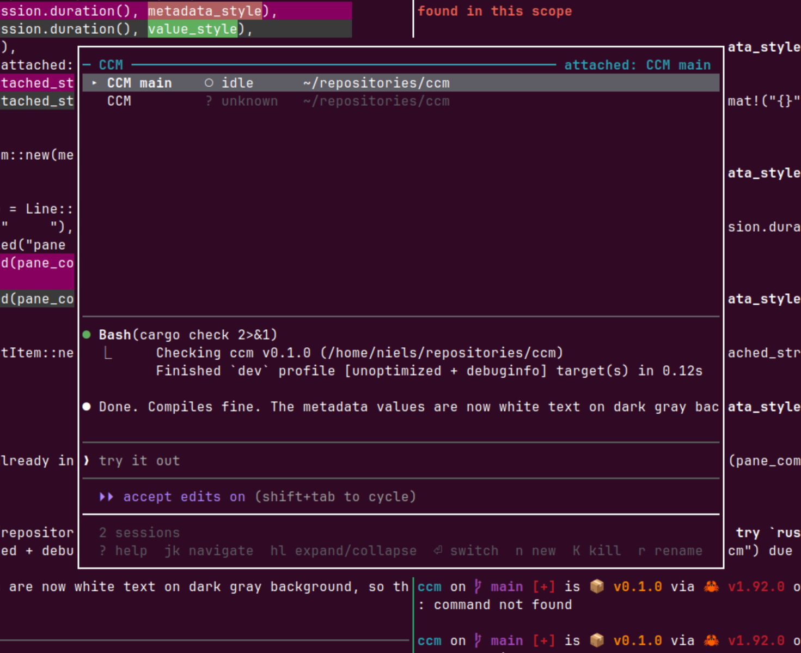

# claude-tmux

A terminal user interface for managing multiple Claude Code sessions within tmux. claude-tmux provides a centralized view of all your Claude Code instances, enabling quick switching, status monitoring, and session lifecycle management, including git worktree and pull request support.

## Fork Changes Summary

This fork introduces several improvements over the [original claude-tmux](https://github.com/nielsgroen/claude-tmux):

### Pane-Focused Architecture

- **ClaudeInstance model**: Replaced session-centric approach with pane-focused `ClaudeInstance` struct that tracks session, window, and pane information
- **Process tree detection**: Identifies Claude Code processes by walking the process ancestry chain (ppid) rather than relying solely on command names
- **Multi-pane support**: Can detect Claude Code instances running in any pane, not just the first pane of a session

### Enhanced Status Detection

- **New prompt formats**: Detects additional Claude Code prompt patterns:
  - Permission prompts: "Do you want to proceed?"
  - AskUserQuestion menus: "Enter to select"
- **More robust detection**: Improved pattern matching for various Claude Code UI states

### Visual Improvements

- **Claude Code branding**: Selected sessions now use Claude Code orange (#D77757) instead of cyan
- **Better contrast**: White text on orange background with bold modifier for selected items
- **Status colors**: Amber for waiting input, medium gray (#999999) for idle sessions
- **Improved spacing**: Added visual separation between header and session list

### Performance Optimizations

- **Fast startup**: UI appears immediately (~50-100ms) instead of blocking until all data loads
- **Progressive loading**: Session list loads first, git context loads progressively in background
- **Batch tmux commands**: Single `list-panes -a` call replaces per-session calls
- **Background threading**: Data loading happens in a background thread with non-blocking UI updates

## Installation

### Cargo install

Just run:

```bash
cargo install claude-tmux
```

Add the following line to your `~/.tmux.conf`:

```bash
bind-key C-c display-popup -E -w 60% -h 60% "~/.cargo/bin/claude-tmux"
```

### Build from source

```bash
git clone https://github.com/nielsgroen/claude-tmux.git
cd claude-tmux
cargo build --release
```

Add this to your `~/.tmux.conf` to bind claude-tmux to a key:

```bash
bind-key C-c display-popup -E -w 60% -h 60% "/path/to/claude-tmux"
```

### How to use

Reload your tmux configuration.
Press `Ctrl-b, Ctrl-c` to open claude-tmux from any tmux session.

To use pull requests, make sure you have `gh` installed.

### Tmux options

Options:
- `-E` — Close popup when claude-tmux exits
- `-w 60% -h 60%` — Popup dimensions (60% of terminal size)

## Features

- **Session Overview** — See all tmux sessions at a glance with Claude Code status indicators
- **Status Detection** — Know whether each Claude Code instance is idle, working, or waiting for input
- **Quick Switching** — Jump to any session with minimal keystrokes
- **Live Preview** — See the last lines of the selected session's Claude Code pane with full ANSI color support
- **Session Management** — Create, kill, and rename sessions without leaving the TUI
- **Expandable Details** — View metadata like window count, pane commands, uptime, and attachment status
- **Fuzzy Filtering** — Quickly filter sessions by name or path

## Screenshots

View the screenshots at [GitHub](https://github.com/nielsgroen/claude-tmux).




**Status indicators:**
- `●` — Working: Claude is actively processing
- `○` — Idle: Ready for input
- `◐` — Waiting for input: Permission prompt (`[y/n]`)
- `?` — Unknown: Not a Claude Code session or status unclear

## Keybindings

### Navigation

| Key | Action |
|-----|--------|
| `j` / `↓` | Move selection down |
| `k` / `↑` | Move selection up |
| `l` / `→` | Expand session details |
| `h` / `←` | Collapse session details |
| `Enter` | Switch to selected session |

### Actions

| Key | Action |
|-----|--------|
| `n` | Create new session |
| `K` | Kill selected session (with confirmation) |
| `r` | Rename selected session |
| `/` | Filter sessions by name/path |
| `Ctrl+c` | Clear filter |
| `R` | Refresh session list |

### Other

| Key | Action |
|-----|--------|
| `?` | Show help |
| `q` / `Esc` | Quit |

## Status Detection

claude-tmux detects Claude Code status by analyzing pane content:

| Pattern | Status |
|---------|--------|
| Input prompt (`❯`) with border above + "ctrl+c to interrupt" | Working |
| Input prompt (`❯`) with border above, no interrupt message | Idle |
| Contains `[y/n]` or `[Y/n]` | Waiting for input |
| Contains "Do you want to proceed?" | Waiting for input |
| Contains "Enter to select" (AskUserQuestion menu) | Waiting for input |
| Otherwise | Unknown |

## Instance Model

claude-tmux uses a pane-focused architecture with `ClaudeInstance` structs that track:

- **Session**: The tmux session containing the instance
- **Window**: The window within the session
- **Pane**: The specific pane running Claude Code

Detection works by:
1. Listing all `claude` processes system-wide
2. Walking each process's parent chain (ppid) to find associated tmux panes
3. Creating a `ClaudeInstance` for each detected pane

This approach supports multiple Claude Code instances per session and accurate process detection regardless of pane position.

Instances are sorted with attached sessions first, then alphabetically by session name.

## Loading Architecture

claude-tmux uses a deferred loading approach for fast startup:

1. **Immediate UI**: `App::new_fast()` returns instantly with an empty instance list
2. **Background thread**: `start_background_loading()` spawns a thread that:
   - Fetches all panes via batch `tmux list-panes -a` command
   - Detects Claude processes and captures pane content for status
   - Sends instances to the main thread via `mpsc` channel
   - Progressively loads git context for each instance
3. **Event loop polling**: `poll_loading()` receives messages non-blocking each frame
4. **Progressive UI updates**: Status bar shows loading state, git info shows "(...)" until loaded

This architecture ensures the UI appears within ~50-100ms regardless of how many sessions exist or how slow git operations are.

## Dependencies

- [ratatui](https://ratatui.rs/) — Terminal UI framework
- [crossterm](https://github.com/crossterm-rs/crossterm) — Terminal manipulation
- [git2](https://github.com/rust-lang/git2-rs) — libgit2 bindings for git operations
- [ansi-to-tui](https://github.com/uttarayan21/ansi-to-tui) — ANSI escape sequence rendering
- [anyhow](https://github.com/dtolnay/anyhow) — Error handling
- [dirs](https://github.com/dirs-dev/dirs-rs) — Home directory resolution
- [unicode-width](https://github.com/unicode-rs/unicode-width) — Text alignment

## Project Structure

```
claude-tmux/
├── Cargo.toml
├── src/
│   ├── main.rs           # Entry point, terminal setup, event loop with background loading
│   ├── app/              # Application state machine
│   │   ├── mod.rs        # App struct, LoadingState, background thread messaging
│   │   ├── mode.rs       # UI mode enum (Normal, ActionMenu, dialogs)
│   │   └── helpers.rs    # Path expansion, sanitization utilities
│   ├── ui/               # Ratatui rendering
│   │   ├── mod.rs        # Main render function, layout, loading states
│   │   ├── dialogs.rs    # Modal dialog rendering
│   │   └── help.rs       # Help screen and message overlays
│   ├── git/              # Git and GitHub operations
│   │   ├── mod.rs        # GitContext detection via libgit2
│   │   ├── operations.rs # push/pull/fetch/commit/stage via git CLI
│   │   ├── worktree.rs   # Worktree and branch management
│   │   └── github.rs     # GitHub CLI (gh) PR operations
│   ├── tmux.rs           # tmux command wrapper, batch pane listing
│   ├── session.rs        # Session, Pane, ClaudeInstance structs
│   ├── detection.rs      # Claude Code status detection
│   ├── input.rs          # Keyboard event handling per mode
│   ├── completion.rs     # Path completion for dialogs
│   └── scroll_state.rs   # List scrolling state management
└── README.md
```
